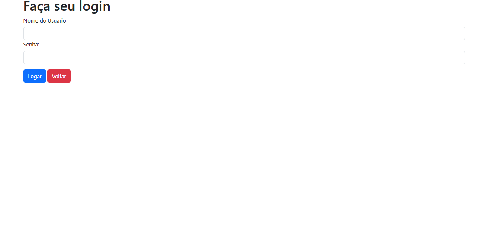
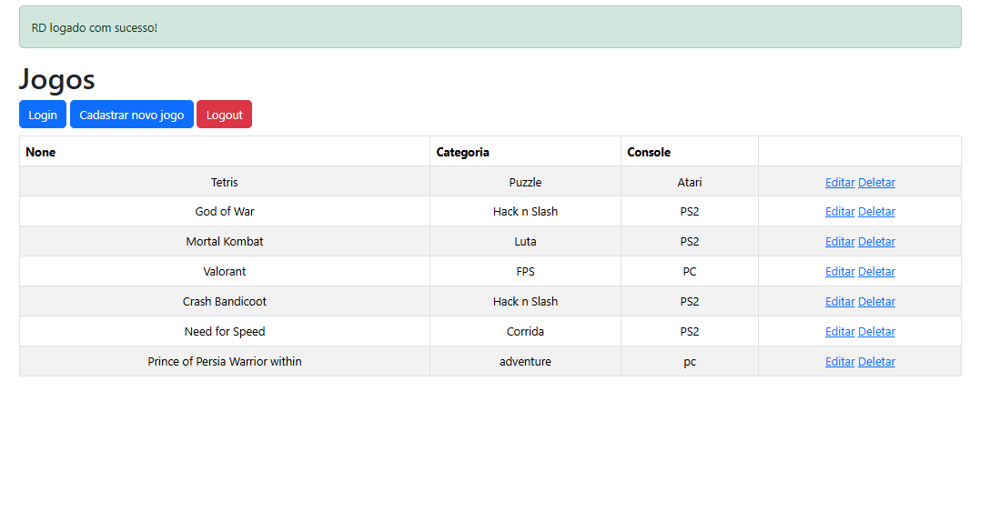
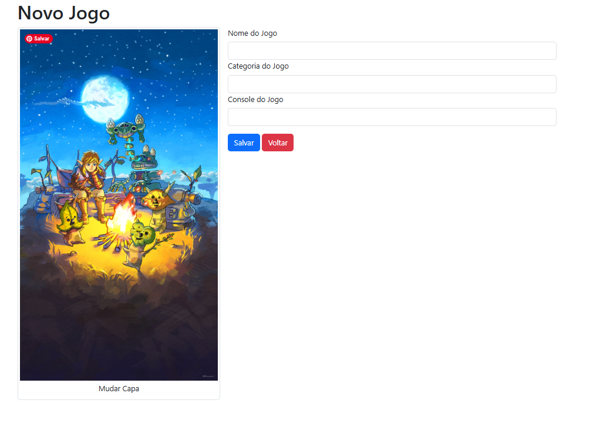
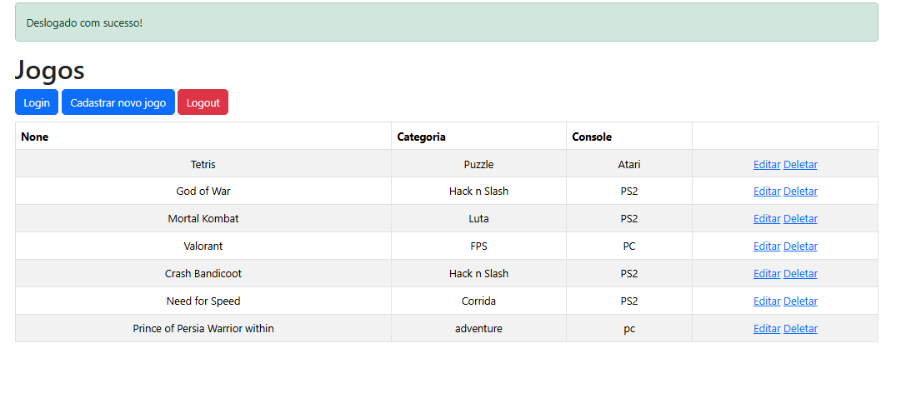

# flaskwebapp-python
Cursos da alura de Flask

* [repositorio dos cursos de python](https://github.com/ronaldodeschain/python_alura)
  
[Flask: crie uma webapp com Python](https://cursos.alura.com.br/course/flask-crie-webapp-python)

[Flask: avançando no desenvolvimento web com Python](https://cursos.alura.com.br/course/flask-desenvolvimento-web)

- Integrar com mysql
- ORM - SqlAlchemy
- Crud completo com verificações
- Adicionar imagens no servidor de aplicação
- Validação de Formulários com Flask WTForms
- Criptografia de senhas com Flask Bcrypt
- views para modelos diferentes
- folha de estilo com bootstrap

